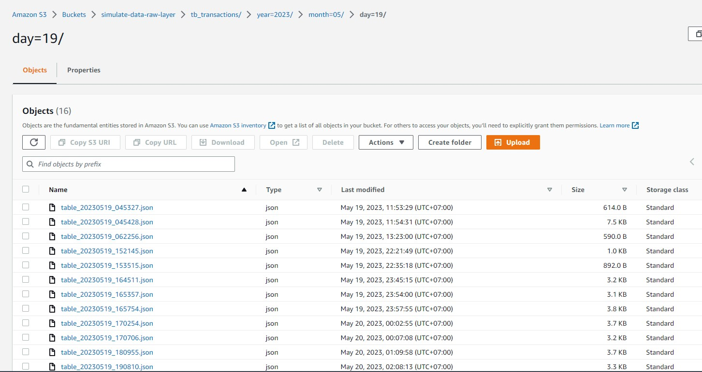

# Simulate Retail Data System


<!-- TABLE OF CONTENTS -->
<details>
  <summary>Table of Contents</summary>
  <ol>
    <li>
      <a href="#project-inspiration">Project Inspiration</a>
      <ul>
        <li><a href="#tech-stack">Tech Stack</a></li>
      </ul>
    </li>
    <li>
      <a href="#getting-started">Getting Started</a>
      <ul>
        <li><a href="#prerequisites">Prerequisites</a></li>
        <li><a href="#set-up">Set up</a></li>
      </ul>
    </li>
  </ol>
</details>


<!-- ABOUT THE PROJECT -->
## Project Inspiration
This project aims to simulate a retailer data system and build a datalake for a start-up company that runs several stores that sell common household products. The project will cover the following aspects:
- Data generation: We will use the Python faker module to generate realistic data for the stores, such as products, prices, sales, inventory, customers, etc.
- Database: Cloud databases such as Postgresql are used to store generated results.
- Datalake: Generated content will then be stored in a datalake for further processing

The project is intended to demonstrate the use of modern technologies for building a data-driven business. 


### Tech Stack

This project uses the following technologies:

- [![Python][Python]][Python-url]
- [![AWS][AWS]][AWS-url]
- [![Postman][Postman]][Postman-url]
- [![Swagger][Swagger]][Swagger-url]


<!-- GETTING STARTED -->
## Getting Started


### Prerequisites

- Python
- Linux
- AWS Account (Most services used in this project are included in AWS Free-Tier)
- Postgres database

### Set up

1. Create a RDS database from AWS. It's fine to use a free-tier database. 

2. Generate a `set_env.sh` file, including the following variables:
```
export DB_USER=<RDS database user>
export DB_PASSWORD=<RDS database password>
export DB_HOSTNAME=<RDS database endpoint name>
export DB_DATABASE=<RDS database name>
export DB_PORT=5432
export S3_LAMBDA_BUCKET=<S3 Bucket name to store Lambda Layer>
export S3_RAW_LAYER_BUCKET=<S3 Bucket name to store Lambda Layer>
export AWS_LAMBDA_LAYER=<Name of your Lambda Layer>
export AWS_LAMBDA_ROLE_ARN=<ARN of IAM role to be used for Lambda functions>
export AWS_PROFILE=<Your selected AWS Profile>
export AWS_REGION=<Your selected AWS Region>
```

**Note**:
- It's important to note that we should NEVER include this file when pushing commits to Git repository to avoid credentials exposed. Make sure, you already ignore `set_env.sh` file in `.gitignore`.
- In case you would like to develop project using local database, it's fine to use local DB credentials.

To set environment variables, run:
```
source set_env.sh
```

3. We can build up a local Python environment using below commands with `conda` in terminal:
```
conda create -n <environment name> python=3.9
conda activate <environment name>
pip install -r requirements.txt
```

4. Database set up
To automatically set up our db, run:
```
python setup_db.py
```

5. Deploy Lambda functions
For this project, we have five Lambda functions that serve the purpose of generating dimensional tables, that are useful to generate mock transactions:
- **generate_customers**: Generate customer information such as gender, name, membership, yob...
- **generate_products**: Generate our offering products.
- **generate_staffs**: Generate our employees information.
- **generate_stores**: Generate store information such as store address, phone, email.
- **generate_transactions**: This Lambda function should be used to generate transactions once you have dimensional data from database by running the 4 above functions. Generated data will then inserted to S3 bucket (Raw layer) for further processing.

There is a built-in bash script that can be used to deploy Lambda functions to AWS:
```
bash deploy-lambda-functions.sh <name of the function>
```

or you can just use the below command to deploy all
```
bash deploy-lambda-functions.sh all
```

6. Deploy API Gateway
Once all of our Lambda functions are available, try to run several functions to generate data for our RDS database.

Then connect the API Gateway (REST API) to the approriate Lambda functions


Because our API call will insert data to the database, we can use POST request method.


7. Test the API from local postman to verify if our endpoint works properly

- Import the Postman collections template [postman_collections](postman_collections/Project-Simulate-Data.postman_collection.json) to Postman.

- Create a Postman environment to replace the variable <API_ENDPOINT>
- Test the endpoint


8. To make it automatically generate data, we can create a AWS EventBridge rule and then connect it to **generate_transactions** Lambda function.

- To create the rule, run: `bash deploy-event-rules.sh`
- Connect the rule to **generate_transactions** Lambda function

9. Now, events will be automatically triggered, and new incoming data will be added to S3 bucket

---


<!-- MARKDOWN LINKS & IMAGES -->
[Python]: https://img.shields.io/badge/python-3670A0?style=for-the-badge&logo=python&logoColor=ffdd54
[Python-url]: https://www.python.org/
[AWS]: https://img.shields.io/badge/AWS-%23FF9900.svg?style=for-the-badge&logo=amazon-aws&logoColor=white
[AWS-url]: https://aws.amazon.com/
[Postman]: https://img.shields.io/badge/Postman-FF6C37?style=for-the-badge&logo=postman&logoColor=white
[Postman-url]: https://www.postman.com/
[Swagger]: https://img.shields.io/badge/-Swagger-%23Clojure?style=for-the-badge&logo=swagger&logoColor=white
[Swagger-url]: https://swagger.io/
